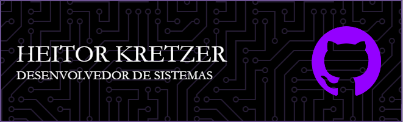

 

 
 

  

  # 💫 About Me:
MEU NOME É HEITOR KRETZER 🙋â€â™‚ï¸  16 ANOS 🈠 MORO EM SÃO JOSÉ, SC 🗺  CURSANDO O ENSINO MÉDIO INTEGRADO 👨â€ğŸ’»  ATUANDO NA AREA DE DESENVOLVIMENTO DE SISTEMAS 🖥  ESTUDO NO SENAI 💻  FORMADO EM CURSO DE INGLÊS(FLUENTE) 🗣 SEMPRE INOVANDO ğŸ¨

## 🌐 Socials:
 

# 💻 Tech Stack:
         	   
# 📊 GitHub Stats:
 
 

## 🏆 GitHub Trophies

### 🔝 Top Contributed Repo

### 😂 Random Dev Meme

---

<!-- Proudly created with GPRM ( https://gprm.itsvg.in ) -->

